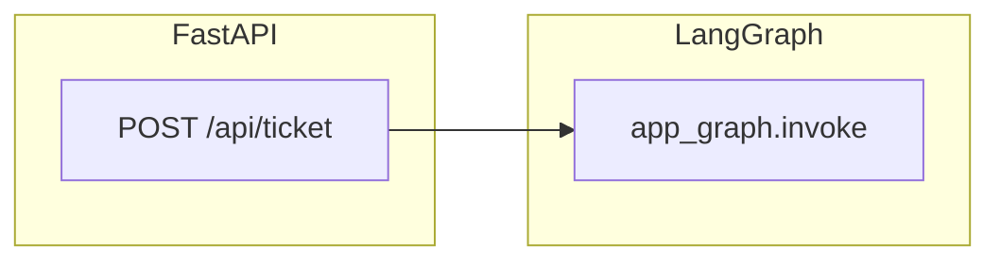
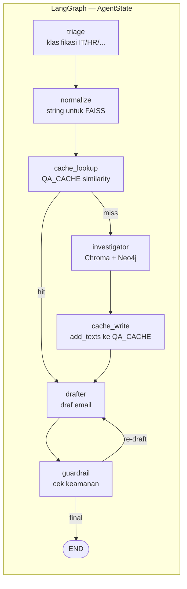
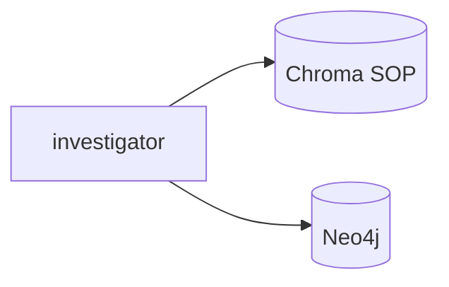

# SyncroDesk Agent

Enterprise-style **helpdesk ticket AI** built with **FastAPI**, **LangGraph**, and **LangChain**. Incoming tickets are classified, enriched with policy text and user or asset context, drafted as a reply, then checked by a lightweight guardrail step. The service is designed to sit behind automation tools such as **n8n**.

## Architecture

High-level request path:



**LangGraph workflow** (matches `agents/graph.py`):



Data stores used on the **miss** path:



| Layer | Role |
|--------|------|
| **`main.py`** | HTTP API: accepts ticket payload, runs the compiled LangGraph app, returns resolution and a small investigation summary. |
| **`agents/graph.py`** | Builds the **StateGraph**: `triage` → `normalize` → `cache_lookup` → (hit → `drafter` \| miss → `investigator` → `cache_write` → `drafter`) → `guardrail`, with conditional **re-draft** loop. |
| **`agents/nodes.py`** | Node implementations: LLM triage (Groq), retrieval from Chroma + stub Neo4j context, drafting, safety check. |
| **`agents/state.py`** | `AgentState` TypedDict: ticket fields, category, `retrieved_docs`, `user_context`, `draft_response`, `is_safe`, and `messages`. |
| **`agents/prompts.py`** | Prompt templates for triage, drafting, and guardrail. |
| **`database/vector_db.py`** | Chroma persistence, OpenAI embeddings, PDF ingest from `data/sops`, `get_retriever()` for top-k similarity search. |
| **`database/graph_db.py`** | Neo4j connection and optional `LLMGraphTransformer` pipeline for graph extraction (separate from per-ticket retrieval). |

### Request lifecycle

1. **Triage** — Classifies the issue into `IT`, `HR`, `FINANCE`, or `GENERAL`.
2. **Normalize** — Builds `normalized_issue` for FAISS cache lookup.
3. **Cache lookup** — If `CAG_ENABLED` and a near neighbor exists under `CACHE_THRESHOLD`, fills `retrieved_docs` / `user_context` from `QA_CACHE` (**hit**); otherwise **miss**.
4. **Investigator** (miss only) — Pulls SOP chunks from Chroma and user/asset context (placeholder Neo4j string today).
5. **Cache write** (miss only) — `add_texts` into `QA_CACHE` for future similar tickets.
6. **Drafter** — Drafts the email using category and context (from cache or DB).
7. **Guardrail** — Validates the draft; if unsafe, loops back to **Drafter**.

## Cache-Augmented Generation (CAG)

**CAG** uses a small **in-memory FAISS** index as a **QA cache**: we store the retrieval bundle (SOP text + user context) keyed by an embedded **fingerprint** of the ticket. New tickets that are **vector-close** to a past one reuse the cached bundle and skip Chroma/Neo4j.

Same idea as:

```python
qa_index = faiss.IndexFlatL2(dim)
QA_CACHE = FAISS(
    embedding_function=OpenAIEmbeddings(...),
    index=qa_index,
    docstore=InMemoryDocstore({}),
    index_to_docstore_id={},
)
CACHE_THRESHOLD = 0.4  # max L2 distance for a hit; smaller = stricter
```

Implementation mirrors a notebook-style block in `cag/cache.py` (`dim`, `qa_index`, `QA_CACHE`, `CACHE_THRESHOLD`). The LangGraph flow adds three steps after triage: **`normalize`** → **`cache_lookup`** → if miss **`investigator`** → **`cache_write`** (uses `QA_CACHE.add_texts` like your example) → **`drafter`**. On a cache hit, **investigator** and **cache_write** are skipped.

### Environment

| Variable | Description |
|----------|-------------|
| `CAG_ENABLED` | `1`, `true`, `yes`, or `on` to turn the cache on (off by default). |
| `CACHE_THRESHOLD` | Max **L2 distance** for a hit (default `0.4`). **Lower = stricter** (fewer hits). |

### Production note

The cache is **one Python process in RAM**. For multiple workers or restarts, add persistence or a shared vector store later.

## Prerequisites

- Python 3.10+ recommended (uses modern typing in `cag/`).
- API keys as required by your stack: **Groq** (LLM in nodes), **OpenAI** (embeddings in `vector_db.py`), **Neo4j** credentials for `graph_db.py`.

## Setup

1. Clone the repository and create a virtual environment.

2. Install dependencies:

   ```bash
   pip install -r requirements.txt
   ```

3. Copy environment variables (create `.env` in the project root), for example:

   - `GROQ_API_KEY`
   - `OPENAI_API_KEY`
   - `NEO4J_URI`, `NEO4J_USERNAME`, `NEO4J_PASSWORD`
   - Optional CAG: `CAG_ENABLED=true`, `CACHE_THRESHOLD=0.4`

4. Ingest SOP PDFs into Chroma (place files under `data/sops/`):

   ```bash
   python database/vector_db.py
   ```

5. Run the API:

   ```bash
   python main.py
   ```

   Or with uvicorn directly:

   ```bash
   uvicorn main:app --host 0.0.0.0 --port 8000
   ```

## API

### `POST /api/ticket`

**Body (JSON)**

| Field | Type | Description |
|-------|------|-------------|
| `ticket_id` | string | Optional; UUID string default on the model if omitted. |
| `user_email` | string | Requester email (used in context and cache key). |
| `issue_text` | string | Free-text problem description. |

**Example**

```json
{
  "user_email": "user@company.com",
  "issue_text": "My MacBook cannot connect to VPN."
}
```

**Success response (shape)**

- `status`: `"success"`
- `ticket_id`, `category`, `resolution` (draft body)
- `investigation_log`: `sop_found` (boolean), `asset_context` (string)

## Project structure (overview)

```
syncrodesk-agent/
├── main.py                 # FastAPI app and /api/ticket
├── requirements.txt
├── agents/
│   ├── graph.py            # LangGraph definition
│   ├── nodes.py            # Triage, investigator, drafter, guardrail
│   ├── state.py
│   └── prompts.py
├── database/
│   ├── vector_db.py        # Chroma + ingest
│   └── graph_db.py         # Neo4j + graph transformer utilities
├── cag/
│   ├── cache.py            # FAISS QA cache (sidik jari tiket + ambil/simpan)
│   └── __init__.py
├── data/sops/              # PDF SOPs for ingestion
└── chroma_db/              # Persisted vector index (after ingest)
```

## License

Specify your license here if you publish this repository.
